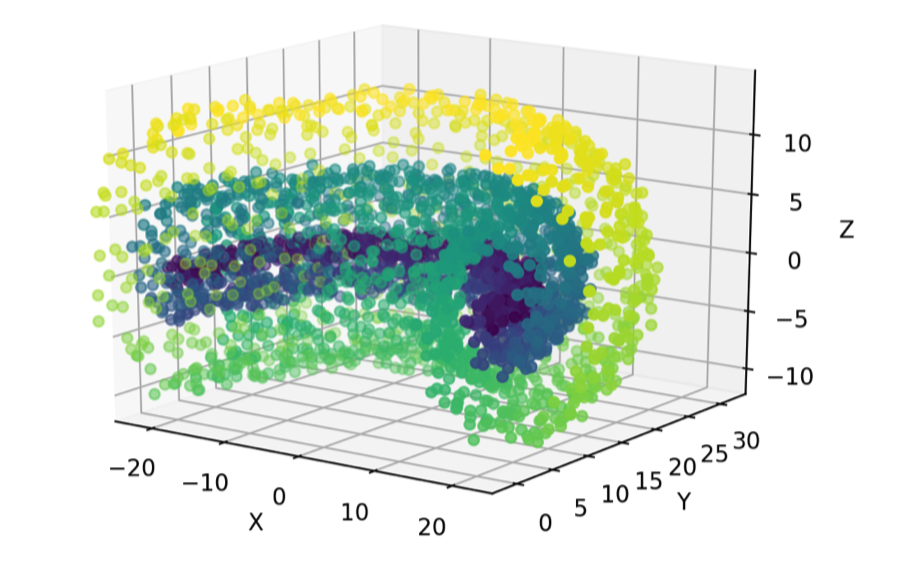
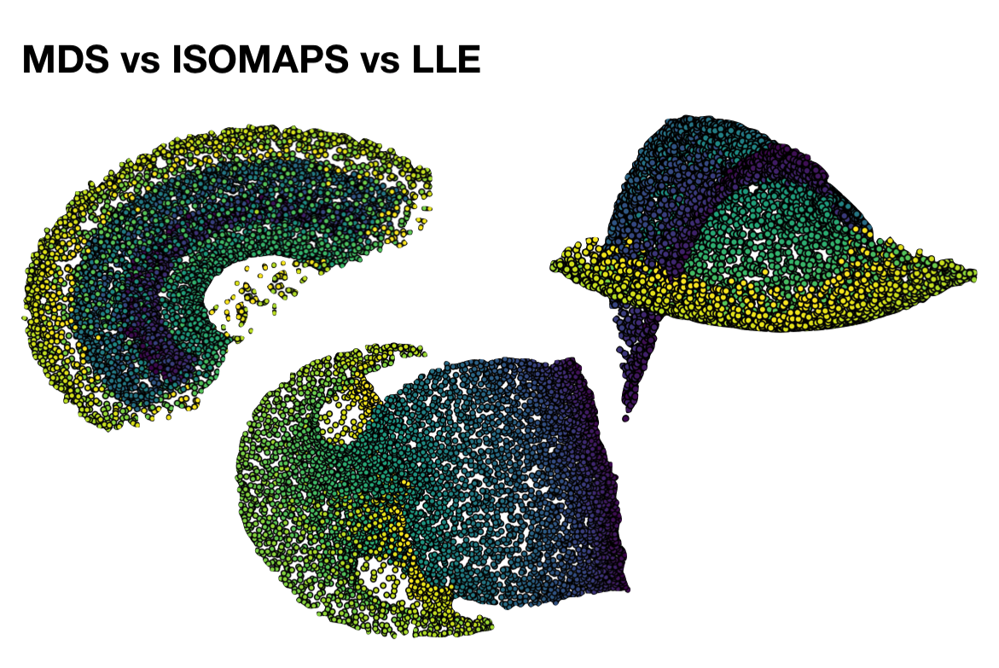
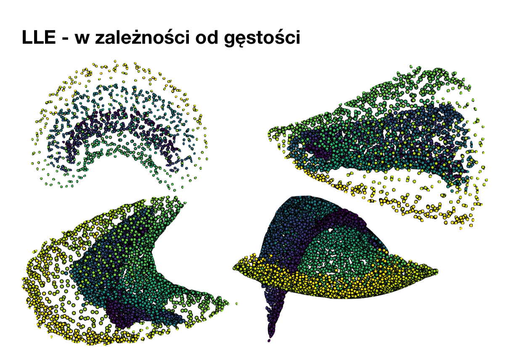
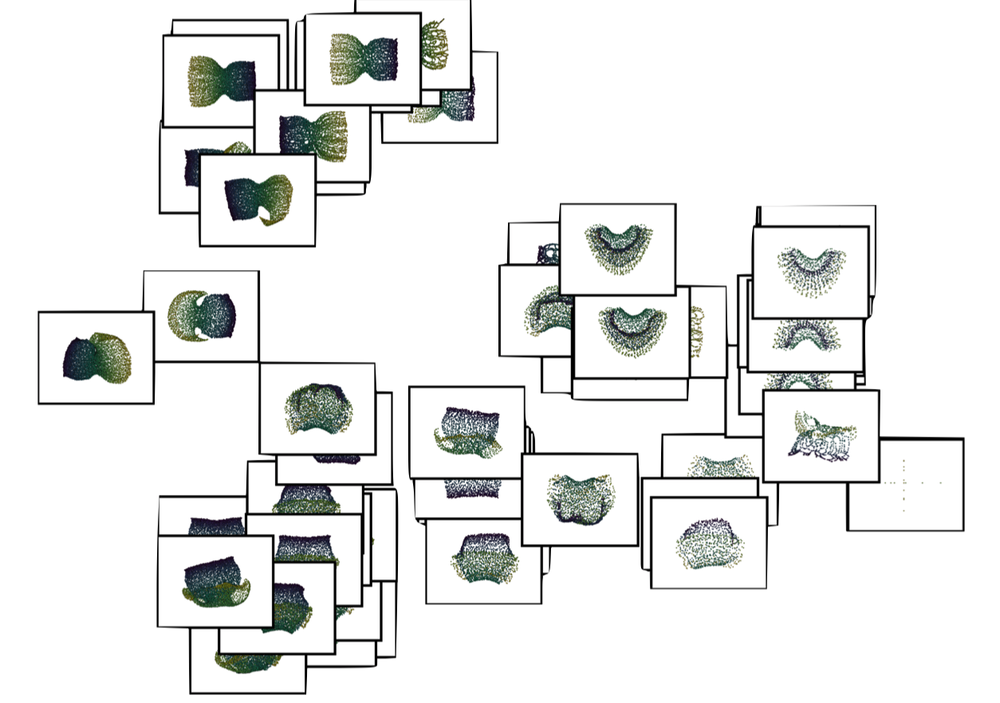

#### Manifold

We compared manifold algorithms on a following 3d shape:

As seen, it is clear that we simply obtain "unrolling of the shape" in the end, but
the results vary depending on the algorithm

The image below presents the different "perspectives" of the original images
and was obtained by tweaking various parameters like number of neighbours.
Points on the image were actually calculated using LLE, by feeding in the images displayed
as annotations. There is some logical structure to the clustering - similar shaped are grouped together and
the transistions between them also are logically presented.

---
title: How to bias a coin?
date: 2022-08-09
layout: post 
categories: [science]
---

A coin is a peculiar sight in my wallet -- I haven't seen one of these in a while, carrying all those digital, plastic cards.
But, it comes in handy ever so often, and I'm sure it's a great way to get some extra cash. Placing a bet on known outcome of a coin toss, it's a conman's game.
How to bias is an art in itself -- can't be to obvious, you gotta show a little effort, work it. 