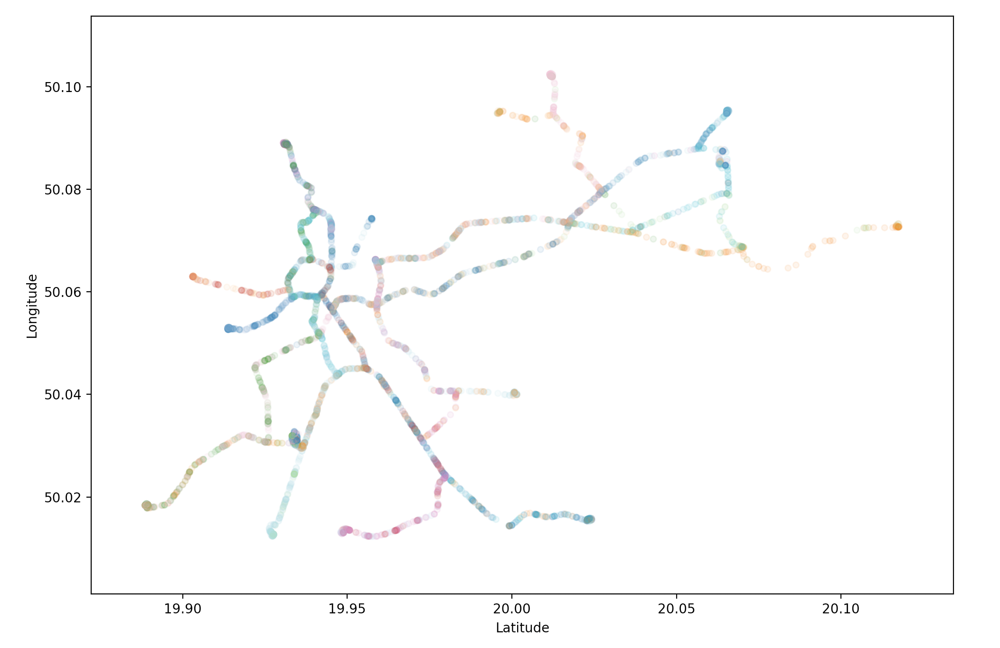
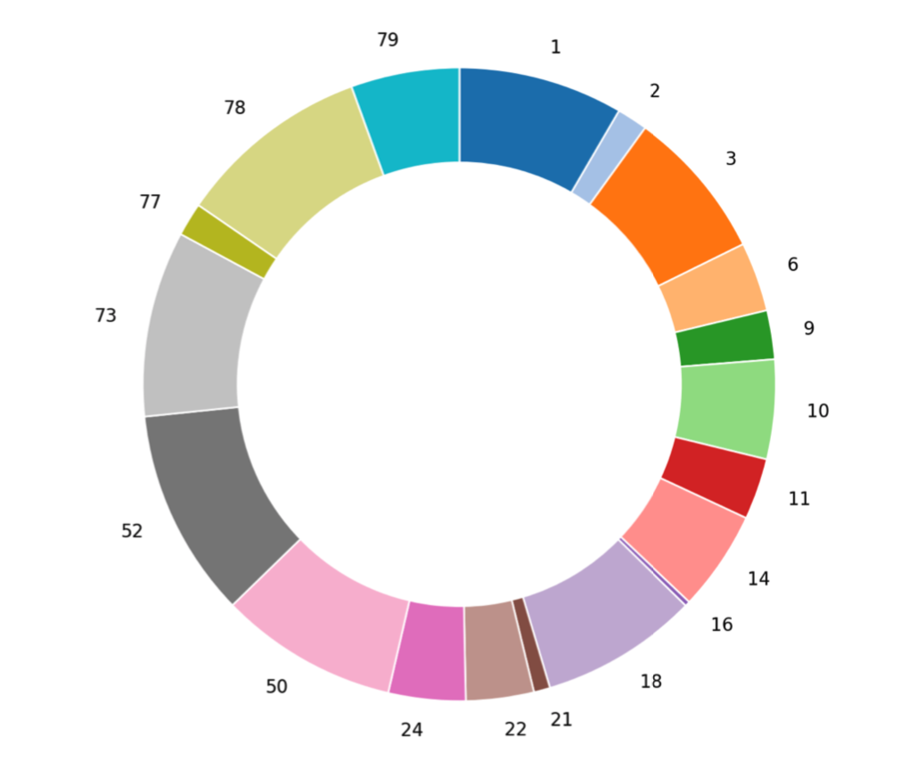

#### Trams

To visualise traffic on legs of Kraków's tram network, the map shows position of trams over the whole day of 13 of March. The different colors indicate lines, additionally the intensity shows number of trams in single location.

Popularity of tram line based of number of recorded points:

Here's live tram peak! Additionally, we can see the current distributions of headings (tram orientations).
Move timeline to -1 to see the whole day. Hourly checkpoints apply. Observe cool night-day cycle!

<HTML>
  
  <h2>Krakow - tram distribution over time and heading barchart</h2>
  

  

  

    

    

  

  
  
  
  
  
  
</HTML>
