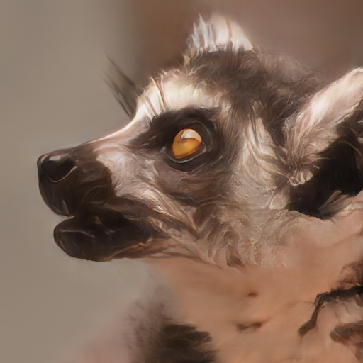

  <h1>Touching the grass</h1>
  </img>
  

  This page does not represent my views as a lemur. It's just an avatar and I'm an actual person.
  Part of the stuff here was probably written by AI at some point. That AI was not made aware of the fact that 
  I am not, in fact, a lemur. Perhaps, it's a good thing.
  

---